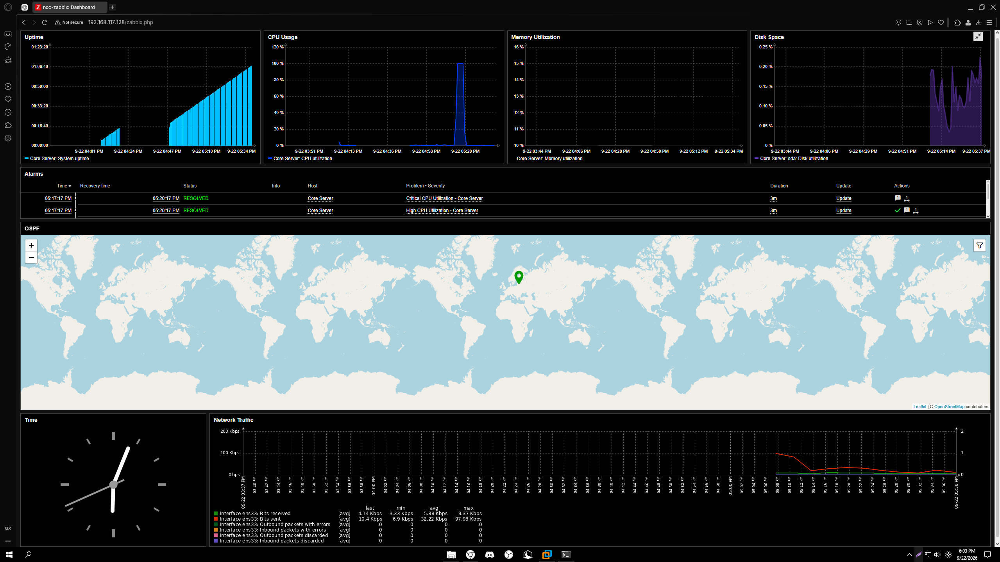
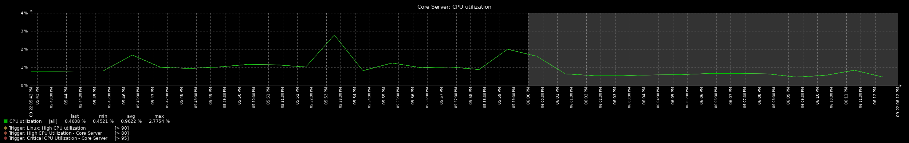
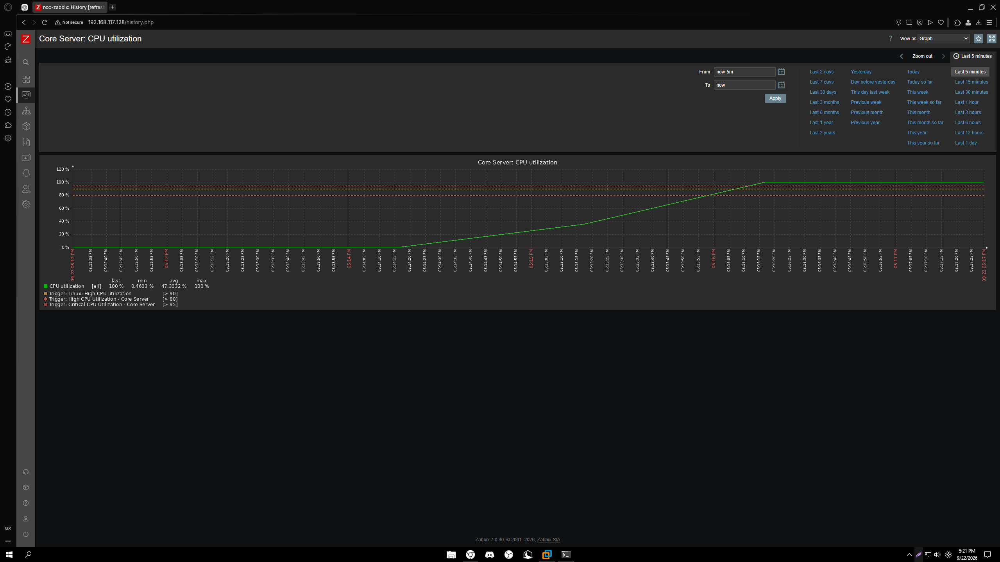
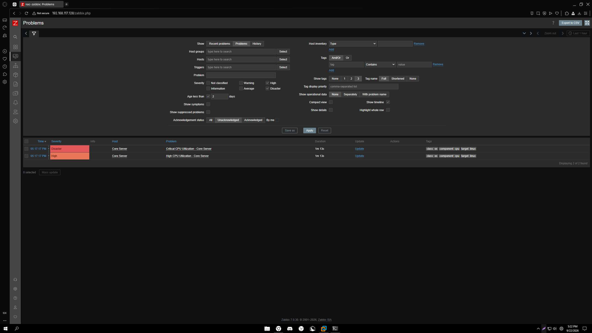
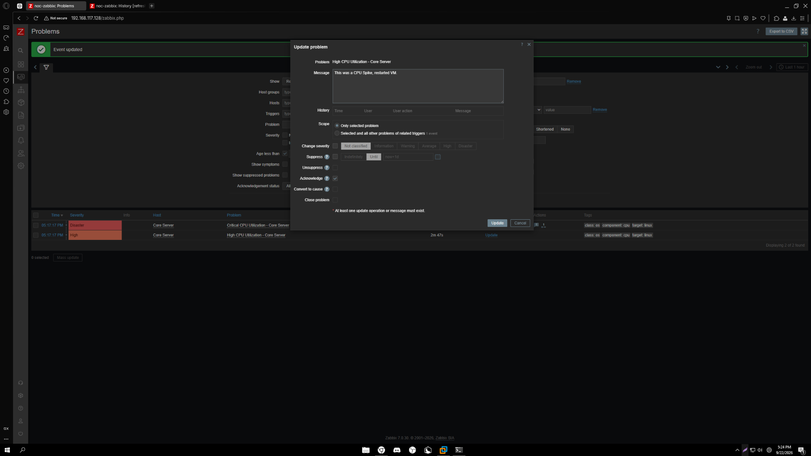
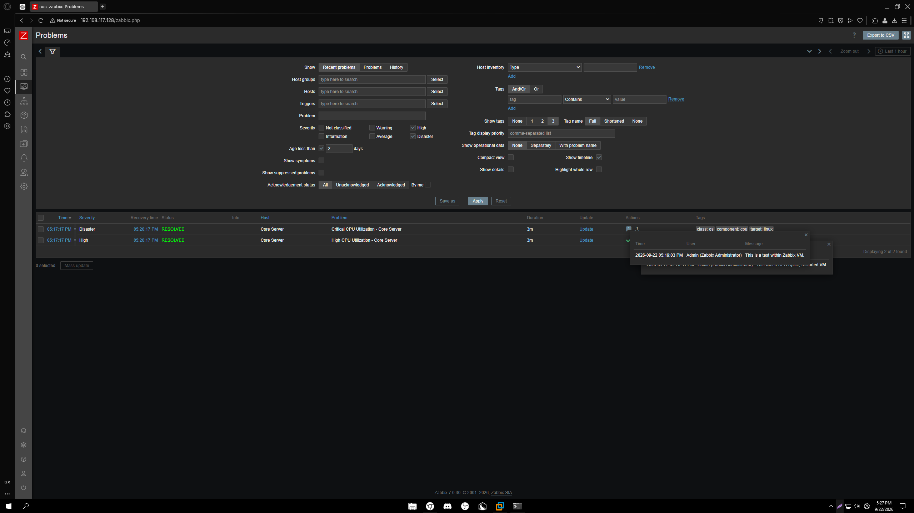

# Zabbix Network Monitoring Lab

A hands-on monitoring lab built with Zabbix 7.0 on Ubuntu Server to simulate common Network Operations Center (NOC) workflows.

The lab monitors Linux server health and network performance, generates severity-based alerts, and demonstrates the full incident lifecycle from detection through acknowledgment and recovery.

## Technologies

- Zabbix 7.0
- Ubuntu Server 24.04 LTS
- Zabbix Agent
- Nginx
- PostgreSQL
- VMware Workstation
- SNMP / ICMP monitoring concepts

## Lab Overview

The Zabbix server and monitored Linux host are deployed on an Ubuntu Server virtual machine.

The environment currently monitors:

- CPU utilization
- Memory utilization
- Disk utilization
- System uptime
- Network interface traffic
- Host availability
- Active monitoring problems

Custom CPU triggers were configured to simulate NOC-style alert escalation.

| Severity | Trigger |
| --- | --- |
| High | CPU utilization > 80% for 2 minutes |
| Disaster | CPU utilization > 95% for 2 minutes |

## Monitoring Dashboard

A custom NOC dashboard provides a centralized view of server health, active/resolved alarms, resource utilization, and network traffic.

## CPU Monitoring

Under normal conditions, CPU utilization remains low and provides a baseline for comparison during incidents.

A controlled CPU stress test was performed to simulate a production performance incident. CPU utilization increased to approximately 100%, crossing the configured High and Disaster thresholds.

## Alert Detection

Zabbix detected the sustained CPU utilization and automatically generated both High and Disaster severity events.

This demonstrates automated threshold-based monitoring rather than relying on manual observation of system performance.

## Incident Acknowledgment

The alert was acknowledged within Zabbix and an incident note was added to document the troubleshooting process.

This simulates a common NOC workflow:

**Monitor → Detect → Investigate → Acknowledge → Remediate → Verify**

## Recovery

After the CPU stress condition was removed, utilization returned to its normal baseline. Zabbix automatically detected the recovery condition and marked the incidents as resolved.

## Skills Demonstrated

- Linux server administration
- Zabbix installation and configuration
- Infrastructure monitoring
- Zabbix Agent configuration
- CPU, memory, disk, uptime, and network monitoring
- Trigger and severity configuration
- Performance baseline analysis
- Alarm monitoring and triage
- Incident acknowledgment and documentation
- Recovery verification
- NOC-style incident workflows
